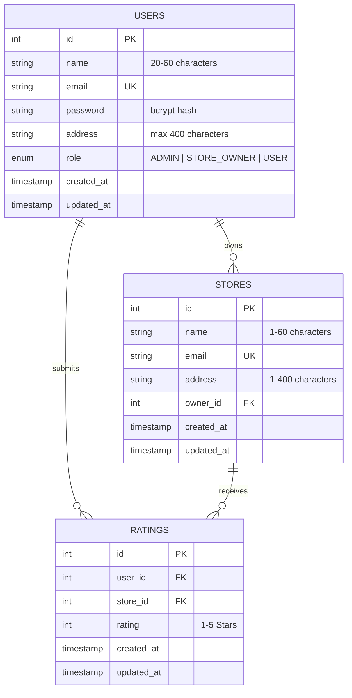

# Store Rating System 🌟

A modern, full-stack, production-ready Web Application built with **React 19**, **Tailwind CSS**, **Node.js / Express 5**, and **AWS RDS MySQL**. The platform features Role-Based Access Control (RBAC), server-side search, filtering, sorting, pagination, interactive star ratings, dynamic average rating calculation, and a sleek SaaS user interface.

The application is structured to deploy as **ONE single project on Vercel**, hosting both the Vite React SPA frontend and the Express REST API serverless functions on the same domain.

---

## 📋 Table of Contents
1. [Project Description](#-project-description)
2. [Key Features](#-key-features)
3. [User Roles & Permissions](#-user-roles--permissions)
4. [Technology Stack](#-technology-stack)
5. [Project Architecture](#-project-architecture)
6. [Database Design](#-database-design)
7. [API Endpoints](#-api-endpoints)
8. [Local Development Setup](#-local-development-setup)
9. [Production Deployment on Vercel](#-production-deployment-on-vercel)
10. [AWS RDS Networking & Security Group](#-aws-rds-networking--security-group)
11. [Health Checks](#-health-checks)
12. [Troubleshooting & FAQ](#-troubleshooting--faq)
13. [Demo Credentials](#-demo-credentials)
14. [License](#-license)

---

## 📝 Project Description

The **Store Rating System** is an enterprise-grade platform that connects consumers, store owners, and platform administrators:
- **Normal Users** can explore registered stores, submit 1–5 star ratings, and manage their ratings.
- **Store Owners** receive dedicated analytics showing overall rating averages and star distribution breakdowns.
- **Administrators** maintain complete control over users, stores, ownership assignment, and platform statistics.

---

## ✨ Key Features

- 🔐 **Secure Authentication**: JWT-based stateless authentication with bcrypt password hashing (cost factor 10).
- 🛡️ **Role-Based Access Control (RBAC)**: Strict server-side and client-side access control for `ADMIN`, `STORE_OWNER`, and `USER` roles.
- ⚡ **Server-Side Search, Filter, Sort & Pagination**: SQL-driven query handling using `URLSearchParams` for high performance.
- ⭐ **Interactive Star Rating Interface**: Users can submit or modify 1–5 star ratings.
- 🚫 **Duplicate Rating Prevention**: Enforced via MySQL `UNIQUE(user_id, store_id)` key constraints returning `409 Conflict`.
- 📊 **Dynamic Rating Aggregation**: Server-calculated `ROUND(AVG(rating), 2)` and total count metrics.
- 🎨 **Modern SaaS UI**: Dark/Light theme built with Tailwind CSS, custom glassmorphism, responsive tables, and micro-interactions.
- 🔒 **Production Security Hardening**: Strict parameterization against SQL injection, non-leaking error handlers, CORS protection, and secure cookie/token handling.
- ☁️ **Single-Project Vercel Deployment**: Unified monorepo deployment with client SPA static build and serverless Express API.

---

## 👥 User Roles & Permissions

| Role | Access & Permissions |
|---|---|
| **`ADMIN`** | • Overview system statistics (total users, stores, ratings, role breakdown)<br>• Manage users (search, filter by role, sort, paginate)<br>• Manage stores (create new stores, assign store owners, sort, paginate)<br>• View all platform ratings |
| **`STORE_OWNER`** | • Dedicated Owner Dashboard displaying assigned store details<br>• Real-time average rating & total rating metrics<br>• 1 to 5 star rating distribution breakdown<br>• Paginated customer ratings table (Customer Name, Email, Rating, Date) |
| **`USER`** | • Browse store catalog with search, filter, and sort capabilities<br>• Submit a 1–5 star rating for any store<br>• Modify previously submitted ratings<br>• View and update account security settings (Password change) |

---

## 💻 Technology Stack

### **Frontend**
- **Framework**: React 19 SPA
- **Build Tool**: Vite
- **Styling**: Tailwind CSS v4
- **State Management**: React Context API (`AuthContext`, `ThemeContext`)
- **HTTP Client**: Native `fetch()` API with configurable base URL

### **Backend**
- **Runtime**: Node.js (ES Modules, Node 20+)
- **Framework**: Express 5
- **Database Driver**: `mysql2/promise` with connection pooling & keepalive
- **Security**: `bcrypt` (password hashing), `jsonwebtoken` (JWT tokens), `cors`

### **Database & Hosting**
- **Database**: AWS RDS MySQL 8.0+ (`store-rating-db.cxsaewym2tpp.eu-north-1.rds.amazonaws.com`)
- **Deployment**: Vercel (Unified Frontend + Serverless API)

---

## 🏗️ Project Architecture

```
store-rating-system/
├── client/                      # React 19 Frontend (Vite)
│   ├── src/
│   │   ├── components/          # UI Components (Navbar, Layout, Modal, StarRating, etc.)
│   │   ├── context/             # AuthContext & ThemeContext
│   │   ├── pages/               # Views (Login, Register, Admin, Owner, User Stores, Profile)
│   │   ├── services/            # API client layer (auth, stores, ratings, admin, owner)
│   │   └── App.jsx              # Main application router
│   ├── package.json
│   └── vite.config.js
├── server/                      # Express REST API
│   ├── config/                  # Database pool & connection setup (db.js)
│   ├── controllers/             # Business logic & SQL queries
│   ├── middleware/              # JWT auth & RBAC validation middleware
│   ├── routes/                  # Express route modules
│   ├── app.js                   # Modular Express app instance
│   ├── server.js                # Local server listener
│   └── package.json
├── api/
│   └── index.js                 # Vercel serverless function entrypoint
├── database/
│   ├── schema.sql               # MySQL DDL schema and seed data
│   └── README.md
├── package.json                 # Monorepo root package.json
├── vercel.json                  # Vercel build & route rewrite configuration
├── .gitignore                   # Workspace gitignore rules
├── .env.example                 # Environment variables template
└── README.md                    # Documentation
```

---

## 🗄️ Database Design



---

## 🔌 API Endpoints

### **System & Health**
- `GET /api/health` — Basic server liveness check
- `GET /api/health/db` — AWS RDS MySQL database connectivity test (`SELECT 1`)

### **Authentication (`/api/auth`)**
- `POST /api/auth/register` — Register a new normal user account
- `POST /api/auth/login` — Authenticate and receive JWT token
- `GET /api/auth/me` — Fetch authenticated user profile details
- `POST /api/auth/change-password` — Update user password

### **Store Operations (`/api/stores`)**
- `GET /api/stores` — Get paginated stores with search, sort, and user ratings
- `GET /api/stores/:id` — Get detailed store info and average ratings
- `POST /api/stores` — Create a new store (*ADMIN only*)
- `PUT /api/stores/:id` — Update store details (*ADMIN or assigned STORE_OWNER*)
- `DELETE /api/stores/:id` — Delete a store (*ADMIN only*)

### **Rating Operations (`/api/ratings`)**
- `POST /api/ratings` — Submit a rating (*USER only*)
- `GET /api/ratings/:storeId` — Get all ratings for a store
- `PUT /api/ratings/:id` — Modify an existing rating (*Owner of rating only*)
- `DELETE /api/ratings/:id` — Delete a rating (*Owner of rating or ADMIN*)

### **Admin Operations (`/api/admin`)**
- `GET /api/admin/dashboard` — Platform overview statistics (*ADMIN only*)
- `GET /api/admin/users` — Paginated user management list (*ADMIN only*)
- `GET /api/admin/stores` — Paginated store management list (*ADMIN only*)
- `GET /api/admin/ratings` — Paginated system rating logs (*ADMIN only*)

### **Owner Operations (`/api/owner`)**
- `GET /api/owner/dashboard` — Store owner statistics & rating distribution (*STORE_OWNER only*)
- `GET /api/owner/ratings` — Paginated customer ratings table (*STORE_OWNER only*)

---

## ⚙️ Local Development Setup

### **1. Prerequisites**
- **Node.js**: v18.0.0 or higher
- **npm**: v9.0.0 or higher
- **MySQL Server** (local) or access to **AWS RDS MySQL**

### **2. Install Dependencies**
```bash
# Install root dependencies
npm install

# Install client dependencies
npm install --prefix client
```

### **3. Configure Environment Variables**
Create `.env` in the root directory (or `server/.env`):
```env
DB_HOST=store-rating-db.cxsaewym2tpp.eu-north-1.rds.amazonaws.com
DB_PORT=3306
DB_NAME=store_rating_db
DB_USER=admin
DB_PASSWORD=your_database_password
JWT_SECRET=your_secure_jwt_secret_key
NODE_ENV=development
PORT=5000
VITE_API_URL=/api
```

### **4. Start Local Development Servers**
In terminal 1 (Backend API):
```bash
npm run server:dev
# Running on http://localhost:5000
```

In terminal 2 (Frontend Client):
```bash
npm run client:dev
# Running on http://localhost:5173
```

---

## 🚀 Production Deployment on Vercel

The repository is pre-configured for a **single unified Vercel deployment** via `vercel.json` and `api/index.js`.

### **Step-by-Step Vercel Deployment:**

1. **Push Changes to GitHub**:
   ```bash
   git add .
   git commit -m "Configure full-stack single project deployment for Vercel"
   git push origin main
   ```

2. **Open Vercel Dashboard**:
   - Go to [vercel.com/dashboard](https://vercel.com/dashboard)
   - Click **"Add New..."** > **"Project"**
   - Select and import your GitHub repository (`store-rating-system`).

3. **Project Settings**:
   - **Root Directory**: `./` (Leave as repository root)
   - **Framework Preset**: `Vite` (or `Other`)
   - **Build Command**: `npm run build --prefix client` (automatically picked from `vercel.json`)
   - **Output Directory**: `client/dist` (automatically picked from `vercel.json`)
   - **Install Command**: `npm install && npm install --prefix client` (automatically picked from `vercel.json`)

4. **Add Environment Variables in Vercel**:
   In the Vercel **Environment Variables** section, add the following:

   | Variable Name | Example / Expected Value | Description |
   |---|---|---|
   | `DB_HOST` | `store-rating-db.cxsaewym2tpp.eu-north-1.rds.amazonaws.com` | AWS RDS MySQL endpoint |
   | `DB_PORT` | `3306` | MySQL port |
   | `DB_NAME` | `store_rating_db` | Database name |
   | `DB_USER` | `admin` | Database username |
   | `DB_PASSWORD` | `<your-rds-password>` | AWS RDS master password |
   | `JWT_SECRET` | `<your-random-64-character-secret>` | Strong production JWT secret |
   | `NODE_ENV` | `production` | Production mode |
   | `VITE_API_URL` | `/api` | Relative same-origin API path |

5. **Deploy**:
   - Click **Deploy**.
   - Vercel will build the frontend assets into `client/dist` and bundle `/api/index.js` as the serverless function.

6. **Verify Deployment**:
   - Visit `https://<your-project>.vercel.app/api/health` — Should return `{ "status": "ok", "success": true }`.
   - Visit `https://<your-project>.vercel.app/api/health/db` — Should return `{ "status": "ok", "database": "connected" }`.
   - Open `https://<your-project>.vercel.app/` in your browser to test login, ratings, and dashboard views.

---

## 🌐 AWS RDS Networking & Security Group

> [!IMPORTANT]
> **Why RDS Inbound Rule Configuration is Required**:
> Vercel Serverless Functions run across AWS regional compute clusters with dynamic outbound IP addresses. If your RDS Security Group is currently restricted to only your personal home/office IP address, Vercel functions will not be able to connect to the database.

### **How to Configure RDS Inbound Access:**
1. Open the **AWS Management Console** and navigate to **Amazon RDS** > **Databases**.
2. Select `store-rating-db`.
3. Under **Connectivity & security**, click the link under **VPC security groups**.
4. In the Security Group details page:
   - Click **Edit inbound rules**.
   - Add a rule:
     - **Type**: `MySQL/Aurora` (Port `3306`)
     - **Source**: `Custom` > `0.0.0.0/0` (Anywhere IPv4)
     - **Description**: `Allow inbound MySQL for Vercel serverless API`
   - Click **Save rules**.
5. Ensure the RDS instance has **Publicly Accessible: Yes** (under connectivity configuration) so that external serverless functions can resolve its DNS endpoint.

---

## 🩺 Health Checks

You can monitor and verify connectivity at any time:

- **Server Liveness**:
  ```http
  GET https://<your-project>.vercel.app/api/health
  ```
  Response:
  ```json
  {
    "status": "ok",
    "success": true,
    "message": "Store Rating API is healthy and running"
  }
  ```

- **RDS Database Connection**:
  ```http
  GET https://<your-project>.vercel.app/api/health/db
  ```
  Response:
  ```json
  {
    "status": "ok",
    "success": true,
    "database": "connected",
    "message": "Database connection verified successfully"
  }
  ```

---

## ❓ Troubleshooting & FAQ

### 1. Database Connection Timeout (`ETIMEDOUT` / `ECONNREFUSED`)
- **Cause**: The AWS RDS Security Group is blocking incoming connections from Vercel.
- **Fix**: Verify that port `3306` is open to `0.0.0.0/0` in the RDS VPC Security Group, and that **Publicly Accessible** is enabled on the RDS instance.

### 2. Direct URL Refresh Returns 404 (e.g., `/dashboard` or `/login`)
- **Cause**: SPA routing rewrite rule missing.
- **Fix**: Handled automatically in `vercel.json` via the catch-all rewrite rule (`/(.*)` -> `/index.html`).

### 3. API Requests Return HTML instead of JSON
- **Cause**: `/api/*` requests being caught by the SPA rewrite rule.
- **Fix**: Handled automatically in `vercel.json` because `/api/(.*)` -> `/api/index.js` is placed before `/(.*)` -> `/index.html`.

---

## 👤 Demo Credentials

The seeded database contains the following test accounts (all default passwords: `Password123!`):

| Role | Email | Password | Access |
|---|---|---|---|
| **Admin** | `admin@storerating.com` | `Password123!` | Admin Dashboard, User & Store Management |
| **Store Owner** | `carlos@apextech.com` | `Password123!` | Owner Dashboard, Store Analytics |
| **Store Owner** | `elena@urbanroast.com` | `Password123!` | Owner Dashboard, Store Analytics |
| **Normal User** | `alice@example.com` | `Password123!` | Store Catalog, Rating Submission, Profile |
| **Normal User** | `bob@example.com` | `Password123!` | Store Catalog, Rating Submission, Profile |

---

## 📜 License

This project is open-source and licensed under the [ISC License](LICENSE).
