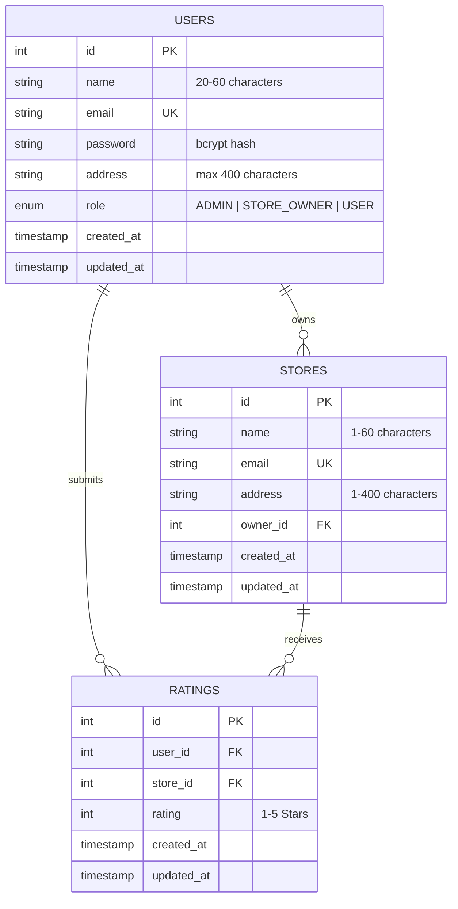

# Store Rating System 🌟

A modern, full-stack, production-ready Web Application built with **React**, **Tailwind CSS**, **Node.js / Express**, and **MySQL**. The application features Role-Based Access Control (RBAC), server-side search, filtering, sorting, pagination, interactive star ratings, dynamic average rating calculation, and a sleek dark-mode SaaS user interface.

---

## 📋 Table of Contents
1. [Project Description](#-project-description)
2. [Key Features](#-key-features)
3. [User Roles & Permissions](#-user-roles--permissions)
4. [Technology Stack](#-technology-stack)
5. [Project Architecture](#-project-architecture)
6. [Database Design](#-database-design)
7. [API Endpoints](#-api-endpoints)
8. [Installation Instructions](#-installation-instructions)
9. [MySQL Database Setup](#-mysql-database-setup)
10. [Environment Variables](#-environment-variables)
11. [Running the Backend](#-running-the-backend)
12. [Running the Frontend](#-running-the-frontend)
13. [Demo Credentials](#-demo-credentials)
14. [Screenshots](#-screenshots)
15. [Future Improvements](#-future-improvements)

---

## 📝 Project Description

The **Store Rating System** is a enterprise-grade platform that connects consumers, store owners, and platform administrators. Users can explore registered stores, submit 1–5 star ratings, and manage their personal feedback. Store owners receive dedicated dashboard analytics showing customer ratings and rating distributions. Administrators maintain complete control over user roles, store creation, and platform health.

---

## ✨ Key Features

- 🔐 **Secure Authentication**: JWT-based stateless authentication with bcrypt password hashing (cost factor 10).
- 🛡️ **Role-Based Access Control (RBAC)**: Strict server-side and client-side access control for `ADMIN`, `STORE_OWNER`, and `USER` roles.
- ⚡ **Server-Side Search, Filter, Sort & Pagination**: SQL-driven query handling using `URLSearchParams` for high performance.
- ⭐ **Interactive Star Rating Interface**: Users can submit or modify 1–5 star ratings.
- 🚫 **Duplicate Rating Prevention**: Enforced via MySQL `UNIQUE(user_id, store_id)` key constraints returning `409 Conflict`.
- 📊 **Dynamic Rating Aggregation**: Server-calculated `ROUND(AVG(rating), 2)` and total count metrics.
- 🎨 **Modern SaaS UI**: Custom dark theme built with Tailwind CSS, custom glassmorphism, responsive tables, and micro-interactions.
- 🔒 **Input Security & Validation**: Complex password checking, name length boundaries (20–60 chars), address limit (400 chars), and SQL injection protection via parameterized queries.

---

## 👥 User Roles & Permissions

| Role | Access & Permissions |
|---|---|
| **`ADMIN`** | • Overview system statistics (total users, stores, ratings, role breakdown)<br>• Manage users (search, filter by role, sort, paginate)<br>• Manage stores (create new stores, assign store owners, sort, paginate)<br>• View all platform ratings |
| **`STORE_OWNER`** | • Dedicated Owner Dashboard displaying assigned store details<br>• Real-time average rating & total rating metrics<br>• 1 to 5 star rating distribution breakdown<br>• Paginated customer ratings table (Customer Name, Email, Rating, Date) |
| **`USER`** | • Browse store catalog with search, filter, and sort capabilities<br>• Submit a 1–5 star rating for any store<br>• Modify previously submitted ratings<br>• View and update account security settings (Password change) |

---

## 💻 Technology Stack

### **Frontend**
- **Framework**: React 19 SPA
- **Build Tool**: Vite
- **Styling**: Tailwind CSS v4
- **State Management**: React Context API (`AuthContext`)
- **HTTP Client**: Native `fetch()` API

### **Backend**
- **Runtime**: Node.js (ES Modules)
- **Framework**: Express 5
- **Database Driver**: `mysql2/promise` with connection pooling
- **Security**: `bcrypt` (password hashing), `jsonwebtoken` (JWT tokens), `cors`

### **Database**
- **Database Engine**: MySQL 8.0+

---

## 🏗️ Project Architecture

```
store-rating-system/
├── client/                      # React Frontend (Vite)
│   ├── src/
│   │   ├── components/          # Reusable UI (Navbar, Sidebar, Modal, Alert, Input, StarRating)
│   │   ├── context/             # AuthContext provider & state
│   │   ├── pages/               # Views (Login, Register, Admin, Owner, User Stores, Profile)
│   │   ├── services/            # API abstraction layer using native fetch()
│   │   └── App.jsx              # React Router setup & ProtectedRoutes
│   └── package.json
├── server/                      # Node.js Express REST API
│   ├── config/                  # Database pool & connection setup
│   ├── controllers/             # Business logic & SQL queries
│   ├── middleware/              # JWT auth & RBAC validation middleware
│   ├── routes/                  # Express API route modules
│   ├── init_db.js               # Database schema initialization script
│   ├── server.js                # Server entry point
│   └── package.json
├── .gitignore                   # Workspace gitignore rules
├── .env.example                 # Environment variables template
└── README.md                    # Documentation
```

---

## 🗄️ Database Design

The system utilizes three core relational tables with foreign key constraints:



> **Note**: A `UNIQUE KEY (user_id, store_id)` constraint on the `ratings` table strictly prevents multiple ratings for the same store by a single user.

---

## 🔌 API Endpoints

### **Authentication (`/api/auth`)**
- `POST /api/auth/register` — Register a new normal user account
- `POST /api/auth/login` — Authenticate and receive JWT token
- `GET /api/auth/me` — Fetch authenticated user profile details
- `PUT /api/auth/change-password` — Update user security password

### **Store Operations (`/api/stores`)**
- `GET /api/stores` — Get paginated stores with search, sort, and user ratings
- `GET /api/stores/:id` — Get detailed store info and average ratings
- `POST /api/stores` — Create a new store (*ADMIN only*)
- `PUT /api/stores/:id` — Update store details (*ADMIN or assigned STORE_OWNER*)
- `DELETE /api/stores/:id` — Delete a store (*ADMIN only*)

### **Rating Operations (`/api/ratings`)**
- `POST /api/ratings` — Submit a rating (*USER only*)
- `GET /api/ratings/:storeId` — Get all ratings for a store
- `PUT /api/ratings/:id` — Modify an existing rating (*Owner of rating only*)
- `DELETE /api/ratings/:id` — Delete a rating (*Owner of rating or ADMIN*)

### **Admin Operations (`/api/admin`)**
- `GET /api/admin/dashboard` — Platform overview statistics (*ADMIN only*)
- `GET /api/admin/users` — Paginated user management list (*ADMIN only*)
- `GET /api/admin/stores` — Paginated store management list (*ADMIN only*)
- `GET /api/admin/ratings` — Paginated system rating logs (*ADMIN only*)

### **Owner Operations (`/api/owner`)**
- `GET /api/owner/dashboard` — Store owner statistics & rating distribution (*STORE_OWNER only*)
- `GET /api/owner/ratings` — Paginated customer ratings table (*STORE_OWNER only*)

---

## ⚙️ Installation Instructions

### **Prerequisites**
- **Node.js**: v18.0.0 or higher
- **npm**: v9.0.0 or higher
- **MySQL Server**: v8.0 or higher

### **1. Clone the Repository**
```bash
git clone https://github.com/your-username/store-rating-system.git
cd store-rating-system
```

### **2. Install Dependencies**

**Install Server Dependencies:**
```bash
cd server
npm install
```

**Install Client Dependencies:**
```bash
cd ../client
npm install
```

---

## 🗃️ MySQL Database Setup

1. Make sure your MySQL Server service is running.
2. Configure your MySQL credentials in `server/.env` (see template below).
3. Run the automated database initializer from the `server` directory:
```bash
cd server
node init_db.js
```

**Option B — Full Schema with Seed Data** (creates tables + demo users, stores, ratings):
```bash
mysql -u root -p < database/schema.sql
```

> Use **Option A** for a clean database or **Option B** to start with demo data already loaded.

---

## 🔑 Environment Variables

Create a `.env` file inside the `server/` directory based on `.env.example`:

```env
# Server Configuration
PORT=5000

# Database Configuration
DB_HOST=localhost
DB_PORT=3306
DB_USER=root
DB_PASSWORD=your_mysql_password
DB_NAME=store_rating_db

# Authentication Secret
JWT_SECRET=your_jwt_secret_key_here
```

---

## 🚀 Running the Backend

From the `server` directory:
```bash
npm start
```
The REST API will start running on `http://localhost:5000`.

---

## 🖥️ Running the Frontend

From the `client` directory:
```bash
npm run dev
```
The React development application will run on `http://localhost:5173`.

---

## 👤 Demo Credentials

You can either **register a new account** through the UI or **seed the database** with demo data:

```bash
# From the project root — run the full seed script in MySQL
mysql -u root -p < database/schema.sql
```

The seed script creates the following accounts (all passwords are `Password123!`):

| Role | Email | Password | Access |
|---|---|---|---|
| **Admin** | `admin@storerating.com` | `Password123!` | Admin Dashboard, User & Store Management |
| **Store Owner** | `carlos@apextech.com` | `Password123!` | Owner Dashboard, Store Analytics |
| **Store Owner** | `elena@urbanroast.com` | `Password123!` | Owner Dashboard, Store Analytics |
| **Normal User** | `alice@example.com` | `Password123!` | Store Catalog, Rating Submission, Profile |
| **Normal User** | `bob@example.com` | `Password123!` | Store Catalog, Rating Submission, Profile |

> The seed also creates 5 stores and 11 sample ratings across all stores.

---

## 📸 Screenshots

*(Include screenshots of your live application interface here)*

- **Admin Dashboard**: System summary cards, role distribution, user table.
- **Store Catalog**: Glassmorphism store cards, 1–5 star rating picker, search/sort controls.
- **Owner Dashboard**: Rating breakdown distribution chart and customer rating logs.
- **Account Security**: Password complexity checklist and user profile management.

---

## 🔮 Future Improvements

- [ ] **Image Uploads**: Cloud storage integration (S3/Cloudinary) for store logos and banners.
- [ ] **Export Reports**: Downloadable CSV and PDF reports for store owner rating analytics.
- [ ] **Real-Time Notifications**: WebSocket/Socket.io integration for instant rating updates.
- [ ] **Dark/Light Theme Toggle**: User preference setting for dynamic theme selection.

---

## 📜 License

This project is open-source and available under the [ISC License](LICENSE).
