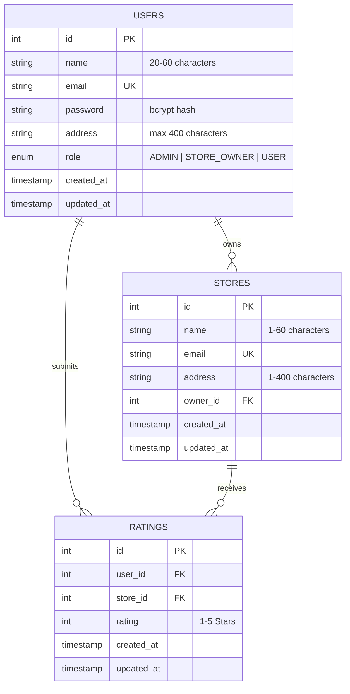

# Store Rating System 🌟

A modern, full-stack, production-ready Web Application built with **React 19**, **Tailwind CSS**, **Node.js / Express 5**, and **AWS RDS MySQL**. The platform features Role-Based Access Control (RBAC), server-side search, filtering, sorting, pagination, interactive star ratings, dynamic average rating calculation, and a sleek SaaS user interface.

The application is architected for **single-project Vercel deployment**, serving both the Vite React SPA frontend and the Express REST API serverless functions from the same unified domain.

---

## 📋 Table of Contents

1. [Project Description](#-project-description)
2. [Complete Application Flow](#-complete-application-flow)
3. [Key Features](#-key-features)
4. [User Roles & Permissions](#-user-roles--permissions)
5. [Assessment Validation Rules](#-assessment-validation-rules)
6. [Technology Stack](#-technology-stack)
7. [Project Architecture](#-project-architecture)
8. [Database Design](#-database-design)
9. [API Endpoints](#-api-endpoints)
10. [Local Development Setup](#-local-development-setup)
11. [Production Deployment on Vercel](#-production-deployment-on-vercel)
12. [AWS RDS Networking & Security](#-aws-rds-networking--security)
13. [Health Checks & Verification](#-health-checks--verification)
14. [Troubleshooting & FAQ](#-troubleshooting--faq)
15. [Demo Credentials](#-demo-credentials)
16. [License](#-license)

---

## 📝 Project Description

The **Store Rating System** is an enterprise-grade platform that connects consumers, store owners, and platform administrators:

- **Normal Users** can explore registered stores, search and filter by name or address, submit 1–5 star ratings, and modify their feedback.
- **Store Owners** receive a dedicated dashboard showing real-time store analytics, overall rating averages, rating distributions, and customer feedback.
- **Administrators** maintain complete control over users, stores, ownership assignment, and platform statistics.

---

## 🔄 Complete Application Flow

### 1. Visitor & Normal User Flow

```text
Landing Page
    │
    ├── Sign In ───────────────┐
    │                          │
    └── Register               │
         │                     │
         ▼                     │
   Validate Name/Email/        │
   Address/Password            │
         │                     │
         ▼                     │
 POST /api/auth/register       │
         │                     │
         ▼                     │
    USER account               │
         │                     │
         └──────────► Login ◄──┘
                          │
                          ▼
                   Verify credentials
                          │
                          ▼
                     Issue JWT
                          │
                          ▼
                  role = USER
                          │
                          ▼
                   Store Catalog
```

### 2. Administrator Flow

```text
Sign In
   │
   ▼
POST /api/auth/login
   │
   ▼
role = ADMIN
   │
   ▼
Admin Dashboard
   │
   ├── View total users
   ├── View total stores
   ├── View total ratings
   │
   ├── Manage Users
   │     ├── Create USER
   │     ├── Create ADMIN
   │     └── Create STORE_OWNER
   │
   ├── Manage Stores
   │     ├── Create Store
   │     └── Assign Store Owner
   │
   ├── Search / Filter / Sort / Paginate
   │
   └── View platform rating information
```

### 3. Store Owner Flow

```text
Admin creates STORE_OWNER
          │
          ▼
Assign Store
          │
          ▼
Store Owner uses the SAME login page
          │
          ▼
POST /api/auth/login
          │
          ▼
Backend verifies credentials
          │
          ▼
JWT contains STORE_OWNER role
          │
          ▼
Owner Dashboard
          │
          ├── Assigned Store
          ├── Average Rating
          ├── Total Ratings
          ├── Rating Distribution
          └── Customers Who Rated
```

### 4. Rating & Real-Time Aggregation Flow

```text
Normal User
    │
    ▼
Store Catalog
    │
    ├── Search by Name / Address
    ├── Sort by Rating, Name, Date
    │
    ▼
Store Card
    │
    ├── Overall Rating = AVG(all submitted user ratings)
    ├── Your Rating = current user's submitted rating
    │
    ▼
Submit / Modify Rating (1–5 Stars)
    │
    ▼
POST /api/ratings (or PUT /api/ratings/:id)
    │
    ▼
MySQL updates `ratings` table
    │
    ▼
Recalculate SQL aggregate: ROUND(AVG(rating), 2)
    │
    ▼
Instant Store Average Update
```

---

## ✨ Key Features

- 🔐 **Secure JWT Authentication**: Stateless authentication with bcrypt password hashing (10 salt rounds) and HS256 JWT signing.
- 🛡️ **Role-Based Access Control (RBAC)**: Strict server-side and client-side protection for `ADMIN`, `STORE_OWNER`, and `USER` roles.
- ⚡ **Server-Side Search, Filter, Sort & Pagination**: SQL-driven query handling using `URLSearchParams` for high performance.
- ⭐ **Interactive Star Rating Interface**: Users can submit or modify 1–5 star ratings with instant feedback.
- 🚫 **Duplicate Rating Prevention**: Enforced via MySQL `UNIQUE(user_id, store_id)` constraints with seamless upsert support.
- 📊 **Dynamic Rating Aggregation**: Server-calculated `ROUND(AVG(rating), 2)` and total count metrics.
- 🎨 **Modern SaaS UI**: Dark/Light theme built with Tailwind CSS, custom glassmorphism, responsive tables, and micro-animations.
- 🔒 **Production Security Hardening**: Parameterized SQL queries against SQL injection, non-leaking production error handlers, CORS whitelisting, and secure token handling.
- ☁️ **Single-Project Vercel Deployment**: Unified monorepo deployment with client SPA static build and serverless Express API.

---

## 👥 User Roles & Permissions

The application uses **one single authentication system** for all three roles. The backend determines the user's role upon login and the frontend directs the user to their designated dashboard.

| Role | Access & Permissions |
| :--- | :--- |
| **`ADMIN`** | • View platform statistics (users, stores, ratings)<br>• Create users, administrators, and store owners<br>• Create and manage stores<br>• Assign stores to store owners<br>• Search, filter, sort, and paginate user and store listings<br>• View user details with store-owner rating information<br>• Sign out |
| **`STORE_OWNER`** | • Log in through the unified authentication portal<br>• Access assigned store's dashboard and analytics<br>• View store average rating and total review counts<br>• View list of customers who rated their store<br>• View rating distribution (1–5 star breakdown)<br>• Change password<br>• Sign out |
| **`USER`** | • Public user registration and login<br>• Browse all registered stores<br>• Search stores by name or address<br>• View overall store rating and personal submitted rating<br>• Submit a 1–5 star rating<br>• Modify previously submitted rating<br>• Change password<br>• Sign out |

---

## ✅ Assessment Validation Rules

The following rules are strictly enforced across both client and server:

| Field | Rule | Validation Description |
| :--- | :--- | :--- |
| **User Name** | 20–60 characters | Required for user registration and user creation |
| **Store Name** | 1–60 characters | Required for store creation |
| **Address** | Maximum 400 characters | Optional for user; required for stores |
| **Password** | 8–16 characters | Requires at least 1 uppercase letter and at least 1 special character |
| **Email** | Standard email regex | Must be a valid email format and unique in database |
| **Rating** | Integer 1–5 | Enforced via SQL `CHECK` constraint and backend validation |

---

## 💻 Technology Stack

### Frontend
- **Framework**: React 19 SPA
- **Build Tool**: Vite
- **Styling**: Tailwind CSS v4
- **State Management**: React Context API (`AuthContext`, `ThemeContext`)
- **HTTP Client**: Native `fetch()` API with configurable base URL

### Backend
- **Runtime**: Node.js (ES Modules, Node 20+)
- **Framework**: Express 5
- **Database Driver**: `mysql2/promise` with connection pooling & keepalive
- **Security**: `bcrypt` (password hashing), `jsonwebtoken` (JWT tokens), `cors`

### Database & Hosting
- **Database**: AWS RDS MySQL 8.0+
- **Deployment**: Vercel (Unified Frontend + Serverless API)

---

## 🏗️ Project Architecture

```
store-rating-system/
├── client/                      # React 19 Frontend (Vite)
│   ├── src/
│   │   ├── components/          # UI Components (Navbar, Layout, Modal, StarRating, etc.)
│   │   ├── context/             # AuthContext & ThemeContext
│   │   ├── pages/               # Views (Login, Register, Admin, Owner, User Stores, Profile)
│   │   ├── services/            # API client layer (auth, stores, ratings, admin, owner)
│   │   └── App.jsx              # Main application router
│   ├── package.json
│   └── vite.config.js
├── server/                      # Express REST API
│   ├── config/                  # Database pool & connection setup (db.js)
│   ├── controllers/             # Business logic & SQL queries
│   ├── middleware/              # JWT auth & RBAC validation middleware
│   ├── routes/                  # Express route modules
│   ├── app.js                   # Modular Express app instance
│   ├── server.js                # Local server listener
│   └── package.json
├── api/
│   └── index.js                 # Vercel serverless function entrypoint
├── database/
│   ├── schema.sql               # MySQL DDL schema and seed data
│   └── README.md
├── package.json                 # Monorepo root package.json
├── vercel.json                  # Vercel build & route rewrite configuration
├── .gitignore                   # Workspace gitignore rules
├── .env.example                 # Environment variables template
└── README.md                    # Project Documentation
```

---

## 🗄️ Database Design



---

## 🔌 API Endpoints

### System & Health
- `GET /api/health` — Basic server liveness check
- `GET /api/health/db` — AWS RDS MySQL database connectivity test (`SELECT 1`)

### Authentication (`/api/auth`)
- `POST /api/auth/register` — Register a new normal user account
- `POST /api/auth/login` — Authenticate and receive JWT token
- `GET /api/auth/me` — Fetch authenticated user profile details
- `POST /api/auth/change-password` — Update user password

### Store Operations (`/api/stores`)
- `GET /api/stores` — Get paginated stores with search, sort, and user ratings
- `GET /api/stores/:id` — Get detailed store info and average ratings
- `POST /api/stores` — Create a new store (*ADMIN only*)
- `PUT /api/stores/:id` — Update store details (*ADMIN or assigned STORE_OWNER*)
- `DELETE /api/stores/:id` — Delete a store (*ADMIN only*)

### Rating Operations (`/api/ratings`)
- `POST /api/ratings` — Submit or modify a rating (*USER only*)
- `GET /api/ratings/:storeId` — Get all ratings for a store
- `PUT /api/ratings/:id` — Modify an existing rating (*Owner of rating only*)
- `DELETE /api/ratings/:id` — Delete a rating (*Owner of rating or ADMIN*)

### Admin Operations (`/api/admin`)
- `GET /api/admin/dashboard` — Platform overview statistics (*ADMIN only*)
- `GET /api/admin/users` — Paginated user management list (*ADMIN only*)
- `GET /api/admin/stores` — Paginated store management list (*ADMIN only*)
- `GET /api/admin/ratings` — Paginated system rating logs (*ADMIN only*)

### Owner Operations (`/api/owner`)
- `GET /api/owner/dashboard` — Store owner statistics & rating distribution (*STORE_OWNER only*)
- `GET /api/owner/ratings` — Paginated customer ratings table (*STORE_OWNER only*)

---

## ⚙️ Local Development Setup

### 1. Prerequisites
- **Node.js**: v18.0.0 or higher (Node 20+ recommended)
- **npm**: v9.0.0 or higher
- **MySQL Server** (local) or **AWS RDS MySQL**

### 2. Install Dependencies
```bash
# Install root dependencies
npm install

# Install client dependencies
npm install --prefix client
```

### 3. Configure Environment Variables
Create a `.env` file in the `server` directory (or repository root):

```env
DB_HOST=localhost
DB_PORT=3306
DB_NAME=store_rating_db
DB_USER=root
DB_PASSWORD=your_password
DB_SSL=false
JWT_SECRET=your_jwt_secret_key_minimum_32_characters
NODE_ENV=development
PORT=5000
VITE_API_URL=/api
```

### 4. Database Setup & Seeding
Execute `database/schema.sql` in your MySQL database to create tables and seed demo accounts:

```bash
mysql -u root -p store_rating_db < database/schema.sql
```

### 5. Start Local Development Servers
In Terminal 1 (Backend API):
```bash
npm run server:dev
# Running on http://localhost:5000
```

In Terminal 2 (Frontend Client):
```bash
npm run client:dev
# Running on http://localhost:5173
```

---

## 🚀 Production Deployment on Vercel

The repository is configured for a **single unified Vercel project** via `vercel.json` and `api/index.js`.

### Deployment Steps:

1. **Push Changes to GitHub**:
   ```bash
   git add .
   git commit -m "Deploy Store Rating System to Vercel"
   git push origin main
   ```

2. **Open Vercel Dashboard**:
   - Go to [vercel.com/dashboard](https://vercel.com/dashboard)
   - Click **Add New...** > **Project**
   - Import your GitHub repository (`store-rating-system`).

3. **Project Settings**:
   - **Root Directory**: `./` (Leave as repository root)
   - **Framework Preset**: `Vite` (or `Other`)
   - **Build Command**: `npm run build --prefix client` (picked from `vercel.json`)
   - **Output Directory**: `client/dist` (picked from `vercel.json`)
   - **Install Command**: `npm install && npm install --prefix client` (picked from `vercel.json`)

4. **Set Environment Variables in Vercel**:
   In Project Settings > Environment Variables, add:

   | Variable Name | Description |
   | :--- | :--- |
   | `DB_HOST` | AWS RDS MySQL endpoint hostname |
   | `DB_PORT` | `3306` |
   | `DB_NAME` | `store_rating_db` |
   | `DB_USER` | AWS RDS master username |
   | `DB_PASSWORD` | AWS RDS master password |
   | `DB_SSL` | `true` |
   | `JWT_SECRET` | Strong random 64-character secret key |
   | `NODE_ENV` | `production` |
   | `VITE_API_URL` | `/api` |

5. **Deploy**:
   Click **Deploy**. Vercel will build the frontend SPA into `client/dist` and bundle `/api/index.js` as the serverless function.

---

## 🌐 AWS RDS Networking & Security

> [!IMPORTANT]
> **RDS Security Group Configuration**:
> Vercel Serverless Functions run across AWS regional compute clusters with dynamic outbound IP addresses. For serverless functions to connect to your AWS RDS database, the RDS Security Group must allow inbound traffic on port 3306.

### Recommended Configuration:
1. Open the **AWS Management Console** > **Amazon RDS** > **Databases**.
2. Select your database instance (`store-rating-db`).
3. Under **Connectivity & security**, click the active **VPC security groups** link.
4. Click **Edit inbound rules** and add:
   - **Type**: `MySQL/Aurora` (Port `3306`)
   - **Source**: `Custom` > `0.0.0.0/0` (Anywhere IPv4)
   - **Description**: `Allow inbound MySQL for Vercel serverless functions`
5. Ensure the RDS instance has **Publicly Accessible: Yes** enabled.

---

## 🩺 Health Checks & Verification

You can monitor and verify connectivity at any time:

- **Server Liveness**:
  ```http
  GET https://<your-project>.vercel.app/api/health
  ```
  *Response:*
  ```json
  {
    "status": "ok",
    "success": true,
    "message": "Store Rating API is healthy and running",
    "timestamp": "2026-09-11T12:00:00.000Z"
  }
  ```

- **RDS Database Connection**:
  ```http
  GET https://<your-project>.vercel.app/api/health/db
  ```
  *Response:*
  ```json
  {
    "status": "ok",
    "success": true,
    "database": "connected",
    "message": "Database connection verified successfully"
  }
  ```


## 👤 Demo Credentials

The database seed script provides test accounts for immediate evaluation (all default passwords: `Password123!`):

| Role | Email | Password | Access Capabilities |
| :--- | :--- | :--- | :--- |
| **Admin** | `admin@storerating.com` | `Password123!` | Admin Dashboard, User Management, Store Creation |
| **Store Owner** | `carlos@apextech.com` | `Password123!` | Owner Dashboard, Store Analytics & Reviews |
| **Store Owner** | `elena@urbanroast.com` | `Password123!` | Owner Dashboard, Store Analytics & Reviews |
| **Normal User** | `alice@example.com` | `Password123!` | Store Catalog, Submit/Modify Ratings, Profile |
| **Normal User** | `bob@example.com` | `Password123!` | Store Catalog, Submit/Modify Ratings, Profile |

---

## 📜 License

This project is open-source and licensed under the [ISC License](LICENSE).
